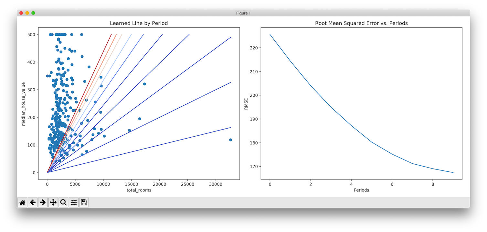

## Test Repository for TensorFlow

This repository is for hands-on study and experimentation of TensorFlow.

### To Run
Prerequisites:
* Make sure to have **Python3**
* Make sure **pip3.6** is installed

Running:
* Open Terminal
* Go to root directory where you `cloned` this project
  * Like so: `$ cd ~/MyProjects/tensorflow_python_test`
* Run: `$ pip3.6 install -r requirements` (only once)
* Run: `$ python3 main.py`
* Sit back and wait for results

### Sample Output

```
$ python3 main.py

Code Start!
Training Model
train_model invoked
Training model...
RMSE (on training data):

  period 00 : 225.63
  period 01 : 214.42
  period 02 : 204.04
  period 03 : 194.97
  period 04 : 187.23
  period 05 : 180.27
  period 06 : 175.22
  period 07 : 171.23
  period 08 : 169.08
  period 09 : 167.45
Model training finished.

       predictions  targets
count      17000.0  17000.0
mean         115.8    207.3
std           95.5    116.0
min            0.1     15.0
25%           64.0    119.4
50%           93.2    180.4
75%          138.0    265.0
max         1661.6    500.0
Final RMSE (on training data): 167.45
Code End!
```


